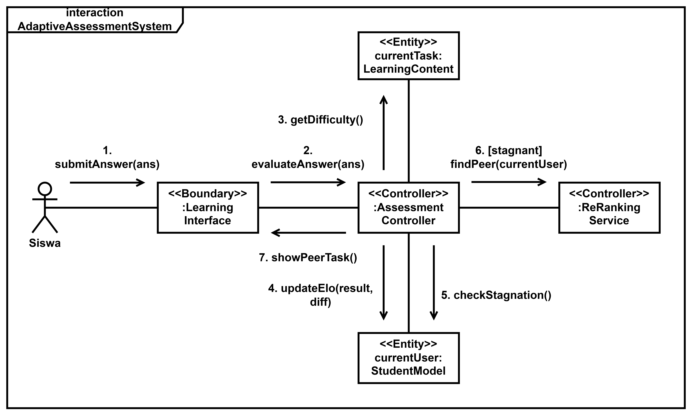

# Equilibria

[](#)
[](#)
[](#)
[](#)
[](#)

> **Prototype of Collaborative Adaptive Assessment System with Overpersonalization Mitigation**  
> An advanced e-learning platform designed for university-level SQL querying instruction, utilizing a Vesin-aligned Elo engine, real-time stagnation detection, and constraint-based peer matching.

---

## 1. Product Overview

Traditional adaptive learning systems optimize exclusively for individual competency, creating **algorithmic overpersonalization** (filter bubbles). Students receive questions that match their current comfort zone, which often leads to learning stagnation, narrow problem-solving exposure, and an illusion of mastery.

**Equilibria** solves this by introducing **proactive cognitive diversification**. It dynamically calibrates question difficulty and student proficiency via a modified Elo-rating system while continuously monitoring for stagnation. When stagnation is detected, it triggers a structured, anonymous **peer-review intervention** matched via constraint-based re-ranking. This dual-track approach ensures personalization enhances learning without isolating the student.

---

## 2. Core System Architecture

Equilibria is built as a split-architecture SPA (Single Page Application) with a decoupled REST API and secure sandboxed query execution.



---

## 3. Core Algorithmic Framework

### 3.1 Vesin-Aligned Individual Elo Update
The system dynamically recalibrates student proficiency ($\theta$) and question difficulty ($D$) using an adapted Elo-rating model (centered at a baseline of `1300.0` within a `[1000, 1800]` range).

$$\theta_{\text{new}} = \text{clamp}(\theta_{\text{old}} + K \times (W - W_e), 1000, 1800)$$

*   **Success Rate ($W$):** Incorporates the student's attempt ratio, sandbox correctness, and time-decay bonuses (Vesin Eq. 3).
*   **Expected Score ($W_e$):** Calculated based on the difference between student capability and question difficulty:
    $$W_e = \frac{1}{1 + 10^{\frac{\theta - D}{400}}}$$
*   **$K$-Factor Decay:** Adapts dynamically as students attempt more questions: `{<10 Qs: 30, 10-24 Qs: 20, 25-49 Qs: 15, ≥50 Qs: 10}`.

### 3.2 Stagnation Detection
Stagnation is detected using a dual-trigger mechanism:
1.  **Primary (Variance Trigger):** Calculated across the last 5 final attempts. If the variance of rating changes ($\Delta\theta$) falls below `165.0` (indicating flatlined progression), stagnation is flagged:
    $$\sigma^2_{\Delta\theta} < 165$$
2.  **Secondary (Fallback Trigger):** Automatically triggered if a user makes $\geq 8$ final attempts in the current chapter without acquiring enough competency to unlock the next module.

### 3.3 Constraint-Based Peer Matching
Once a user is flagged with `NEEDS_PEER_REVIEW`, they are dynamically paired with an active, non-stagnant peer who possesses a meaningful cognitive distance (heterogeneity):
*   **Heterogeneity Enforcement:** The difference in ratings between the student and candidate peer must exceed $0.5$ standard deviations of the active cohort's standard deviation (based on Cohen’s $d \geq 0.5$ effect size convention):
    $$|\theta_{\text{requester}} - \theta_{\text{candidate}}| \geq 0.5 \times \sigma_{\text{cohort}}$$
*   **Selection:** The system filters candidates matching the distance constraint and selects from the top 5 largest differences.

### 3.4 Social Elo & Feedback Scoring
To capture collaborative competency, Equilibria implements a **Social Elo** track ($\theta_{\text{social}}$) that runs in parallel:
*   **Double-Blind Review:** The reviewer evaluates the requester's SQL query and answers against a structured rubric.
*   **Dual Scoring:** The review score is computed by combining peer feedback with automated NLP semantic scoring:
    $$\text{Final Score} = 0.5 \times \text{NLP System Score} + 0.5 \times \text{Requester Vote}$$
    *   *NLP System Score:* Evaluated using sentence embeddings (`paraphrase-multilingual-MiniLM-L12-v2`) checking keyword density, explanation coherence, and pedagogical usefulness.
*   **Theta Display:** The overall student rating shown on the leaderboard and profile is a composite score:
    $$\theta_{\text{display}} = (0.8 \times \theta_{\text{individual}}) + (0.2 \times \theta_{\text{social}})$$

---
## 4. Tech Stack

### Backend (FastAPI)
*   **Framework:** FastAPI (Python 3.12) with fully asynchronous path operations.
*   **ORM & Migrations:** SQLAlchemy 2.0 (using `asyncio` and `asyncpg` connection pooler) & Alembic.
*   **Security:** JWT bearer auth, password hashing via Argon2id (Passlib + Bcrypt).
*   **NLP Embeddings:** `fastembed` (running light CPU-optimized sentence-transformers) for semantic feedback validation.
*   **Testing:** `pytest` & `pytest-asyncio` for unit testing database and algorithms.

### Frontend (React 19)
*   **Build Tool:** Vite.
*   **Styling:** Tailwind CSS 4.x for premium design layouts, responsive structures, and fluid transitions.
*   **State Management:** Zustand (with Zukeeper for local persistency and debugging).
*   **Code Sandbox:** CodeMirror 6 with custom SQL syntax highlighting, theme integration, and live schemas.
*   **Avatars:** DiceBear API integration dynamically generating unique user avatars based on student ID (NIM).

### Database (PostgreSQL 15)
*   **Public Schema:** Manages core transaction state, adaptive sessions, rating histories, and double-blind peer collaborations.
*   **Isolated Sandbox Schema:** Contains a classic Silberschatz-style university database (`student`, `instructor`, `course`, `takes`, `teaches`, etc.) for student query evaluations.

---

## 5. Workspace Directory Structure

```text
Equilibria/
├── client/                     # React 19 + Vite Frontend
│   ├── src/
│   │   ├── assets/             # Media and static vectors
│   │   ├── components/         # Common UI: Auth Guards, Code Editor Displays, Modals
│   │   ├── data/               # Module Markdown Materials
│   │   ├── hooks/              # Custom Toast & Interface states
│   │   ├── pages/              # Dashboards, Active Session, Peer Hub, Pretest, Leaderboard
│   │   ├── routes/             # App routing mappings
│   │   ├── services/           # Axios-wrapped API clients
│   │   ├── store/              # Zustand global states (authStore, sessionStore)
│   │   └── types/              # TS interface contracts
│   ├── package.json
│   └── vite.config.ts
├── server/                     # FastAPI Backend
│   ├── app/
│   │   ├── api/                # FastAPI Routers (auth, session, collaboration, admin)
│   │   ├── core/               # App configuration, security, Elo logic, NLP pipelines
│   │   ├── db/                 # Base Models, Session Builders, and SQL Seed scripts
│   │   ├── schemas/            # Pydantic input/output validation models
│   │   └── tests/              # Pytest backend validation suites
│   ├── alembic/                # DB Schema Migrations
│   ├── logs/                   # JSON logs separated into syslogs/ & asslogs/
│   ├── docker-compose.yml      # Orchestration definition for local deployment
│   ├── Dockerfile
│   └── requirements.txt
├── docs/                       # Specifications, PRD, and Implementation Reports
├── LICENSE                     # MIT License
└── README.md
```

---

## 6. Getting Started & Local Deployment

### 6.1 Prerequisites
Make sure you have the following installed on your system:
*   [Docker Desktop](https://www.docker.com/products/docker-desktop/)
*   [Node.js (v18+)](https://nodejs.org/) & `npm` / `pnpm`
*   [Python 3.12+](https://www.python.org/downloads/) (if running backend outside Docker)

### 6.2 Setting Up the Backend (Docker Compose)
1. Navigate to the `server/` directory:
   ```bash
   cd server
   ```
2. Copy the environment template files:
   ```bash
   cp .env.example .env
   cp .env.db.example .env.db
   ```
3. Boot the PostgreSQL database and FastAPI backend services:
   ```bash
   docker compose up --build -d
   ```
4. Perform database migrations to initialize the schema:
   ```bash
   docker compose exec backend alembic upgrade head
   ```
5. Seed the adaptive module questions and cold-start pretest data:
   ```bash
   docker compose exec backend python -m app.db.seed_sql_questions
   ```
   *Note: This script automatically initializes both the public schema and seeds the classic Silberschatz-style university tables in the isolated sandbox schema.*

### 6.3 Setting Up the Frontend (Vite Client)
1. Navigate to the `client/` directory:
   ```bash
   cd ../client
   ```
2. Install dependencies:
   ```bash
   npm install
   ```
3. Spin up the development server:
   ```bash
   npm run dev
   ```
4. Open [http://localhost:5173](http://localhost:5173) in your browser.

---

## 7. SQL Sandbox Security & Guardrails

To prevent students from executing malicious actions when running custom SQL queries, Equilibria implements a rigorous security model:

> **1. Schema Isolation**
> The server connects to PostgreSQL using the `sandbox_executor` role. This role only has `USAGE` rights on the `sandbox` schema and `SELECT` rights on its tables. It has absolutely **no access** to the `public` schema containing user data, ratings, or logs.

> **2. SQL Statement Blocklist**
> Before a query is evaluated in PostgreSQL, the backend validates it against a strict keyword blocklist. Any query containing:
> `DROP`, `DELETE`, `INSERT`, `UPDATE`, `ALTER`, `CREATE`, `TRUNCATE`, `GRANT`, `REVOKE`, `PG_`, `--`
> is immediately rejected without database execution.

> **3. Execution Timeouts**
> To mitigate denial-of-service attempts via infinite recursive joints or lockups, the backend wraps every student query in a localized connection session that enforces a strict timeout:
> ```sql
> SET LOCAL statement_timeout = 5000; -- Ends query execution if longer than 5 seconds
> ```

---

## 8. Controlled Lab Study Design

Equilibria features a built-in workflow designed for stratified, academic research:
*   **Format:** A two-group pretest-posttest stratified evaluation (Group A vs Group B).
*   **Group A (Experimental Group):** Receives the full adaptive system. Stagnation triggers peer-review matching, collaborative intervention, and Social Elo tracking.
*   **Group B (Control Group):** Operates on an ablation control. Learning stagnation is tracked and logged in the database, but no peer intervention is initiated; they continue in individual adaptive practice.
*   **Duration:** Designed for a 105-minute session (15m adaptive pretest → 75m learning interaction → 15m posttest evaluation).
*   **Key Academic Metrics Evaluated:** Normalized Learning Gain (NLG) ($g \geq 0.3$), rating slope comparison ($\Delta\theta$ pre- vs. post-intervention), Cohen's $d$ heterogeneity effect size, and NLP-validated semantic scores on constructive feedback.

---

## 9. Academic References

*   **Vesin, B., et al. (2022).** *Adaptive Assessment and Content Recommendation in Online Programming Courses.* Basis for the modified Elo rating scaling, student success rate modeling ($W$), and piecewise $K$-factor decay.
*   **Biasio, M., et al. (2023).** *Algorithmic Filter Bubble Mitigation.* Adapts constraint-based re-ranking to avoid educational echo chambers by enforcing cognitive heterogeneity (Cohen’s $d \geq 0.5$).
*   **Kerman, J., et al. (2024).** *Peer Feedback Assessment Rubric.* Standardizes the 4-tier qualitative evaluation metrics (Identification, Justification, Constructive, Bloom’s Action Verbs) evaluated via sentence embeddings.
*   **Silberschatz, A., Korth, H. F., & Sudarshan, S. (2019).** *Database System Concepts.* Origin of the classic university database schema used in the secure query execution sandbox.

---